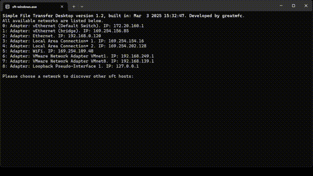

# Introduction

An interactive console application that supports both receiving and sending specified file from and to other Simple-File-Transfer-Desktop/Android hosts.

# Installation

1. Download the compiled binary file.
2. On Windows, you will need Visual Studio 2022 to build the project.
3. On Linux, git clone then make:

```bash
git clone https://github.com/greatmfc/Simple-File-Transfer-Desktop
cd Simple-File-Transfer-Desktop
make
./sft_host.out
```

# Notes

- On Windows, the program requires administrator permission to add a firewall exception when being launched for the first time.
- For every startup, you need to select a network first in order to find the other SFT hosts due to the limitation on Windows.

# Example
