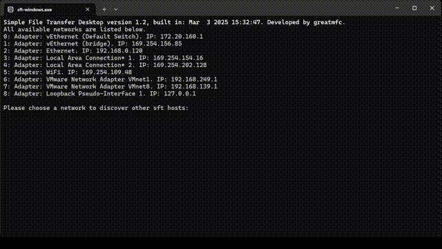

# Introduction [](https://github.com/greatmfc/Simple-File-Transfer-Desktop/actions)

**Version 2.0** - Modern build system with secure encrypted sessions

An interactive console application that supports both receiving and sending specified file from and to other Simple-File-Transfer-Desktop/Android hosts.

# Features

- **End-to-End Encrypted Transmission**: XChaCha20-Poly1305 authenticated encryption with libsodium
- **Secure Handshake Protocol**: Cryptographic authentication and key exchange
- **Modern Build System**: CMake with vcpkg integration and cross-platform presets
- **Cross-platform** (Windows/Linux/macOS/Android)
- **Automatic Peer Discovery**: Automatically search for available SFT clients in local network via UDP broadcast
- **Batch File Transfer**: Send or receive multiple files or folders (Android version does not support sending folders yet)
- **Asymmetric Encryption**: Public-key cryptography for secure session establishment
- **Command-line Interface**: One-time transfer/receive modes with command-line options
- **Interactive & Drag-and-Drop**: Interactive menu on Windows with file/folder dialog support
- **High Performance**: Multi-threaded transfer with configurable chunk sizes
- **Coroutine-based Async I/O**: Non-blocking network operations using C++20 coroutines
- **Unified Error Handling**: Type-safe error propagation with std::expected

# Deployment

## Prerequisites

- **[vcpkg](https://github.com/microsoft/vcpkg)**: Package manager for dependencies
- **libsodium**: Encryption library (automatically installed via vcpkg)
- **CMake 3.25+**: Build system generator
- **C++20 Compatible Compiler**: GCC 13+, Clang 17+, MSVC 2022 17.0+

## Quick Start

### Using CMake Presets (Recommended)

The project includes pre-configured CMake presets for all major platforms:

```bash
git clone https://github.com/greatmfc/Simple-File-Transfer-Desktop
cd Simple-File-Transfer-Desktop

# Configure using a preset (choose based on your platform)
cmake --preset linux-release          # Linux with GCC
cmake --preset linux-clang-release    # Linux with Clang
cmake --preset x64-release            # Windows 64-bit with MSVC
cmake --preset macos-release          # macOS with AppleClang

# Build
cmake --build --preset <preset-name>

# Run the executable
./build/bin/simple-file-transfer
```

### Manual Configuration

```bash
git clone https://github.com/greatmfc/Simple-File-Transfer-Desktop
cd Simple-File-Transfer-Desktop
mkdir build && cd build

# Configure (set VCPKG_ROOT if vcpkg is not in default location)
cmake .. -DCMAKE_BUILD_TYPE=Release -DCMAKE_TOOLCHAIN_FILE=$VCPKG_ROOT/scripts/buildsystems/vcpkg.cmake

# Build
cmake --build . --config Release -j

# Run
./bin/simple-file-transfer
```

## Platform-Specific Notes

### Windows
- **Visual Studio 2022** or **Ninja** with MSVC/Clang-CL
- First run requires administrator permission to add firewall exception
- Select network interface on startup for peer discovery
- Drag-and-drop files onto executable supported
- Presets available: `x64-release`, `x64-debug`, `x64-release-profiling`, `x64-clang-release`, `x86-release`

### Linux
- **GCC 13+** or **Clang 17+** recommended
- Install system dependencies: `sudo apt-get install build-essential cmake`
- No special privileges required
- Presets available: `linux-release`, `linux-debug`, `linux-release-profiling`, `linux-clang-release`

### macOS
- **Xcode Command Line Tools** required
- AppleClang (Xcode 14+ recommended)
- Presets available: `macos-release`, `macos-debug`

## Usage Examples

```bash
# Interactive mode (default)
./simple-file-transfer

# One-time receive mode
./simple-file-transfer -r

# One-time transfer mode with files
./simple-file-transfer -t file1.txt folder/

# Direct connection to specific host
./simple-file-transfer -t file1.txt -a 192.168.1.100:10013

# Show help
./simple-file-transfer -h
```

# Notes

## Security
- **Trust-on-First-Use**: Unknown host fingerprints require manual approval on first connection
- **Key Storage**: Cryptographic keys are stored in platform-specific secure directories:
  - Windows: `%APPDATA%\sft\`
  - Linux/macOS: `~/.config/sft/`
- **Encryption**: All data is encrypted with XChaCha20-Poly1305 using libsodium

## Platform Considerations
- **Windows**: Requires administrator permission for firewall exception on first launch
- **Windows**: Network interface selection required for peer discovery (limitation of Windows networking APIs)
- **Linux/macOS**: No special privileges required

## Build System
- **Profiling Builds**: Use `-release-profiling` presets for performance analysis with debug symbols
- **IDE Support**: Automatic `compile_commands.json` symlinking for clangd/LSP support
- **Static Linking**: Release builds are statically linked for portability

# Example


